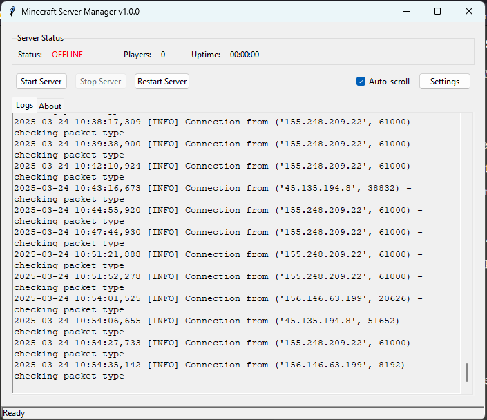

# Minecraft Server Manager

A robust, feature-rich GUI application for managing Minecraft servers with wake-on-demand functionality.

## Features

- **Wake-on-Demand**: Server starts automatically when players try to connect
- **Resource Optimization**: Server shuts down when inactive to save resources
- **Clean Interface**: User-friendly GUI with server status monitoring
- **Protocol-Aware**: Properly distinguishes between status pings and login attempts
- **Robust Error Handling**: Resilient against crashes and connection issues

## Quick Start

1. [Download the latest release](https://github.com/Bazouz660/minecraft-server-manager/releases)
2. Place the executable in your Minecraft server directory
3. Run the application
4. Players can now connect to your server - it will start automatically!

## Documentation

- [Installation Guide](docs/installation.md)
- [Configuration Options](docs/configuration.md)
- [Usage Instructions](docs/usage.md)
- [Development Guide](docs/development.md)

## Requirements

- Windows, macOS, or Linux
- Minecraft Java Edition server jar file
- Python 3.8+ (for running from source)

## License

This project is licensed under the MIT License - see the [LICENSE](LICENSE) file for details.
